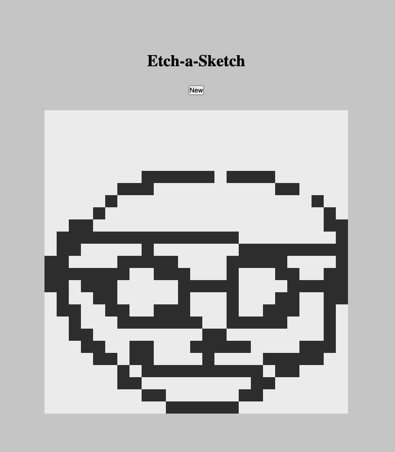

# etch-a-sketch

Live preview: https://taewookim02.github.io/etch-a-sketch/

The objective of creating this app was to get used to DOM manipulation and adding some basic UI by using html, css, and js.

You can edit the number of grid cells per row and columns by clicking the "New" button.
